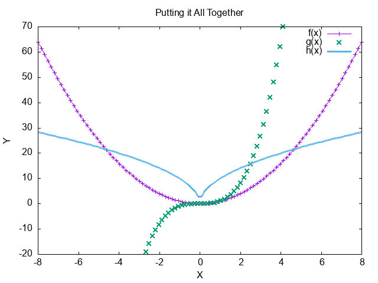

#+title: Playground
#+date: <2025-03-16 Sun>
#+startup: indent
#+startup: num
#+options: ^:{}
#+options: tex:t
#+options: broken-links:t
# #+EXCLUDE_TAGS: ATTACH
#+options: tags:nil
#+options: toc:nil

#+hugo_base_dir: ../

# #+begin_src elisp :exports none
# (setq org-src-preserve-indentation nil)
# (setq org-edit-src-content-indentation 0)
# (setq org-src-tab-acts-natively t)
# #+end_src

#+toc: headlines 1
* Another Heading
#+begin_example
block belongs to head
#+end_example

- item2 :: level1
  - nested
    #+name: qqq
    #+begin_src python :results output
    def test():
        print("test")
    print("???")
    test()
    #+end_src

    #+begin_src python :results output
    print("another print")
    #+end_src

    #+results:
    : another print

- head4 :: 4
     #+begin_example
     block inline of list item
     #+end_example

- head5 :: 5
- it :: ?
- item3 :: 3
- item6 :: this is six-th item
     #+begin_src python :results output :exports both
     print("...")
     #+end_src

     #+results:
     : ...
* Gen a 3x3 latex matrix, filled with random formulas, not too small

Here is a 3x3 LaTeX matrix filled with random formulas:

\begin{bmatrix}
x^2 + y^2 & \sin(\theta) & e^{\pi i} + 1 \\
\log(a + b) & \frac{c}{d} & \sqrt{n^2 + m^2} \\
\tan(x) & \int_0^1 x \, dx & \sum_{i=1}^{n} i^2
\end{bmatrix}
* Headiing2
special symbols: \pi \alpha

This is a inline src block src_shell{echo 'hello inline shell block'} {{{results(=hello inline shell block=)}}}.
This is a inline python[fn:1] inline block src_python[:results output]{print(f"Inline python print output")} {{{results(=Inline python print output=)}}}
below is a shell src block.

#+name: fun1
#+Begin_src shell :exports both :var fname=(buffer-file-name)
echo `basename $fname`
#+end_src

#+results: fun1
: playground.org

And I can refer 'to its output like this: call_fun1('arg') {{{results(=arg=)}}} and something else'
* Gen 5x6 random org table below :ATTACH:
:PROPERTIES:
:ID:       50b3c23f-4834-4ffd-a8c9-98fd748a6744
:END:

Here’s a 5x6 table filled with random numbers:

#+caption[random-table1]: Random Table1
#+name: random-table1
|  1 |  2 |  3 | 4xx |  5 |     6 |
|----+----+----+-----+----+-------|
| 12 | 45 | 23 |  67 | 34 |    89 |
| 68 | 29 | 51 |  74 | 16 |    83 |
| 91 | 22 | 37 |  54 | 18 |    76 |
| 10 | 60 | 33 |  48 | 25 |    92 |
| 15 | 78 | 41 |  57 | 84 |    39 |
|    |    |    |     |    | 10123 |

#+caption: reformat-org-pic1
#+name: fig:reformat-pic
[[attachment:_20250316_104150screenshot.png]]

<2026-04-01 Wed>

-----

#+name: p1
#+begin_src rust :exports both :cache yes
println!("{:?}", 1..10)                      (ref:print1)
#+end_src

#+results: p1
: 1..10

#+begin_src rust :noweb yes
let x = r#"
<<qqq>>
"#;
println!("{}", x)
#+end_src

#+RESULTS:
:
: def test():
:     print("test")
: print("???")
: test()
:

In the line [[(print1)]] we printed a 1.

Inline shell code: src_shell{echo "echo"} {{{results(=prev p1 code is <<qqq()>>=)}}}
Another Inline shell code invode another block: src_shell[:noweb yes]{ echo <<fun1('/tmp/x.org')>> } {{{results(=x.org=)}}}
* Gen 5x6 random org table below

Here's a 5x6 random Org table:

#+caption: numbers2
#+name: org-block-table
#+begin_src org
| Col1 | Col2 | Col3 | Col4 | Col5 | Col6 |
|------|------|------|------|------|------|
| 42   | 17   | 35   | 88   | 65   | 22   |
| 10   | 58   | 49   | 71   | 34   | 70   |
| 56   | 92   | 14   | 41   | 27   | 83   |
| 69   | 31   | 94   | 88   | 21   | 65   |
| 84   | 50   | 19   | 95   | 37   | 45   |
#+end_src

You can generate a new random table by running code in Emacs or manually changing the numbers.
Run the above code in an Org buffer to generate a 5x3 random table. Adjust the =generate-random-org-table= function parameters as desired for different sizes.
* Gnuplot Example

#+caption: numbers1
#+name: data-table
| x | y1 | y2 | xx               |
|---+----+----+------------------|
| 0 |  3 |  6 | [2025-03-16 Sun] |
| 1 |  4 |  7 | <2025-03-16 Sun> |
| 2 |  5 |  8 |                  |

#+caption: plot-src
#+begin_src gnuplot :exports both :file example-gnuplot.png
reset

set title "Putting it All Together"

set xlabel "X"
set xrange [-8:8]
set xtics -8,2,8

set ylabel "Y"
set yrange [-20:70]
set ytics -20,10,70

f(x) = x**2
g(x) = x**3
h(x) = 10*sqrt(abs(x))

plot f(x) w lp lw 1, g(x) w p lw 2, h(x) w l lw 3
#+end_src

#+results:

* Gen random inline latex formulas below

Here are some random inline LaTeX formulas:

1. \( E = mc^2 \)
2. \( a^2 + b^2 = c^2 \)
3. \( \int_0^{\infty} e^{-x} \, dx = 1 \)
4. \( \sum_{n=1}^{\infty} \frac{1}{n^2} = \frac{\pi^2}{6} \)
5. \( \frac{d}{dx}(x^n) = nx^{n-1} \)
* Generate a 5x8 latex matrix non-inlined below, filled with random numbers and letters

Here is a 5x8 LaTeX matrix filled with random numbers and letters:

\begin{pmatrix}
A & 3 & F & 7 & B & 9 & K & 4 \\
2 & D & 1 & X & 8 & E & 5 & M \\
Z & 6 & Y & C & 0 & 2 & J & 3 \\
H & 4 & T & 8 & Q & 1 & L & 7 \\
N & 9 & W & 5 & P & 6 & R & 0 \\
\end{pmatrix}

You can copy and paste this code into your LaTeX document to render the matrix.
* Org Table Plot

#+plot: title:"Citas" ind:1 deps:(3) type:2d with:histograms set:"yrange [0:]"
| Sede      | Max cites | H-index |
|-----------+-----------+---------|
| Chile     |    257.72 |   21.39 |
| Leeds     |    165.77 |   19.68 |
| Sao Paolo |     71.00 |   11.50 |
| Stockholm |    134.19 |   14.33 |
| Morelia   |    257.56 |   17.67 |
* Index

#+toc: listings
#+toc: tables
* Footnotes
[fn:1] A sad language.
